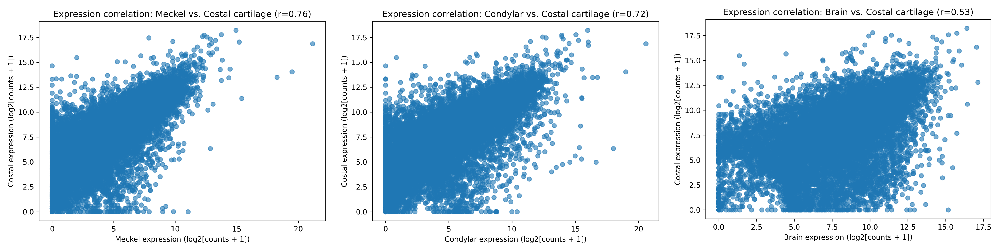

# RNA-seq Data Analysis: Cartilage Transcriptomic Similarity

**Assessing whether costal cartilage can serve as a model for mandibular cartilage using transcriptomic data**

---

## 📊 Example Result

---

## 🔥 Transcriptomic Similarity (Heatmap)

---

## 📌 Project Overview

This project evaluates transcriptional similarity between costal cartilage and craniofacial cartilage tissues in embryonic wild-type (WT) female mice using RNA-seq data.

The analysis was performed to address reviewer concerns regarding the biological relevance of costal cartilage as a comparative model for mandibular cartilage.

---

## 🧬 Data Sources

* GSE121780 – Meckel’s cartilage & mandibular condylar cartilage (E16.5, WT female mice)
* GSE315769 – Brain tissue (E18, WT female mice)
* In-house dataset – Costal cartilage (E17, WT female mice)

---

## ⚙️ Methods

* Gene-level raw count matrices were used
* Only genes shared across all datasets were retained

**Filtering:**

* Removed genes with zero counts across all samples
* Retained genes with mean expression ≥ 10 counts
* Genes were retained only if at least 50% of samples within **at least one tissue group** (Meckel, condylar, costal, or brain) showed non-zero expression  
This multi-step filtering approach reduces noise from lowly expressed and sparse genes while preserving biologically relevant signals.

**Processing:**

* Log2 transformation applied to stabilize variance
* Mean gene expression calculated across biological replicates

**Analysis:**

* Pearson correlation analysis between tissues

---

## 📈 Results

* Meckel vs. costal cartilage: **r = 0.76**
* Condylar vs. costal cartilage: **r = 0.72**
* Brain vs. costal cartilage: **r = 0.53**

---

## 📊 Quantitative Comparison

| Comparison         | Pearson r | R²   | RMSE | Slope | Intercept |
| ------------------ | --------- | ---- | ---- | ----- | --------- |
| Meckel vs Costal   | 0.76      | 0.58 | 3.52 | 0.71  | -0.54     |
| Condylar vs Costal | 0.72      | 0.52 | 3.19 | 0.75  | -0.17     |
| Brain vs Costal    | 0.53      | 0.28 | 2.89 | 0.51  | 4.01      |

These metrics further support stronger linear agreement between costal and craniofacial cartilage tissues compared to brain.

---

## 🧠 Interpretation

Costal cartilage exhibits not only high correlation but also consistent linear scaling (slope ~0.7–0.75) with craniofacial cartilage, suggesting preserved transcriptional relationships across tissues.

---

## 🧠 Conclusion

Costal cartilage shows higher transcriptional similarity to craniofacial cartilage than to brain tissue, supporting its relevance as a comparative model in embryonic studies.

---

## 🛠️ Tools & Technologies

* Python
* pandas
* numpy
* matplotlib / seaborn
* scipy

---

## 🚀 Key Skills Demonstrated

* RNA-seq data processing
* Data filtering and normalization
* Statistical analysis (correlation, regression metrics)
* Data visualization (scatter plots, heatmaps)
* Integration of public and in-house datasets

---

## 📁 Repository Structure

* `scripts/` – data processing and analysis scripts
* `notebooks/` – exploratory analysis (Jupyter notebooks)
* `results/` – figures and plots
* `data/` – processed datasets (no raw sequencing files)

---

## 📎 Notes

This repository contains processed data and analysis scripts only. Raw sequencing data are available through GEO.
